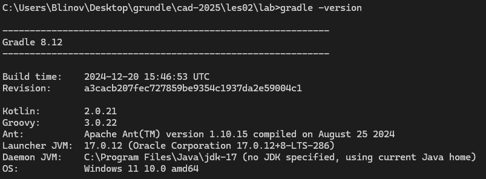
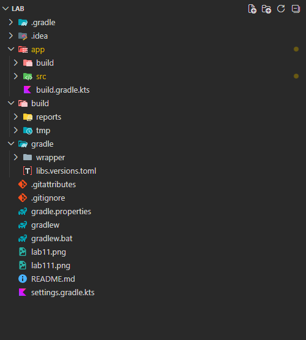
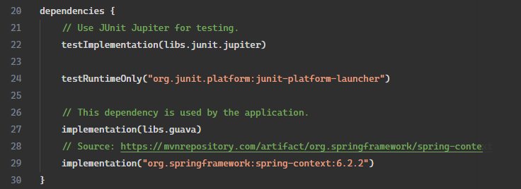
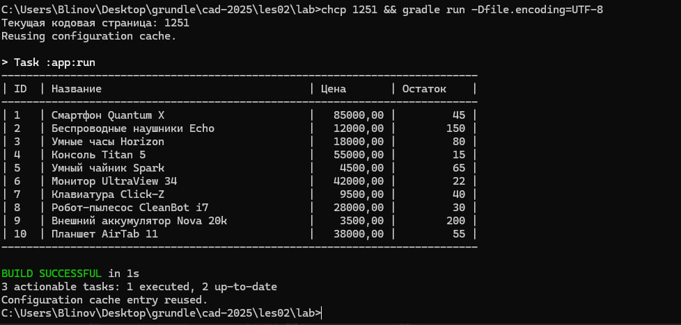

# Отчет о лаботаротоной работе №1

## Цель работы

В данной работе необходимо создать каркас приложения и разобраться с конфигурированием Spring приложений на основе Java классов

## Выполнение работы

В ходе работы были выполнены следующие действия:

1. Установлена `JDK 17`
2. Установлен `Gradle 8.12`

3. Создан проект с помощью команды `gradle init --package ru.bsuedu.cad.lab`

4. В проект добавлена `org.springframework:spring-context:6.2.2`

5. Реализовано консольное приложение

## Выводы

В ходе выполнения работы был создан базовый каркас Spring приложения для магазина товаров для животных.
