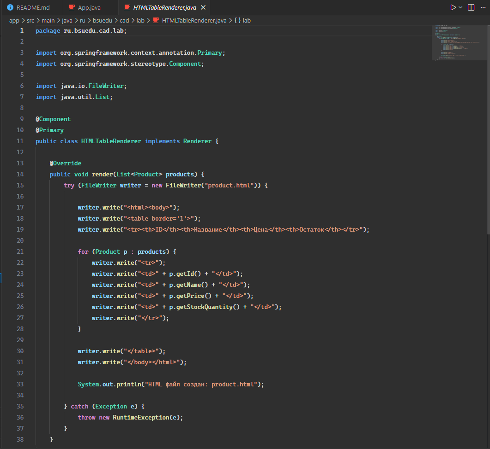
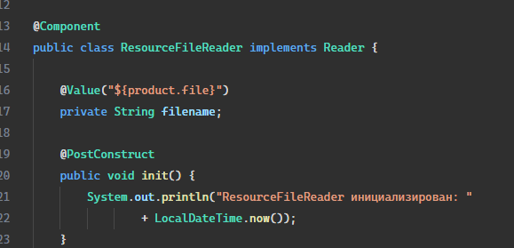
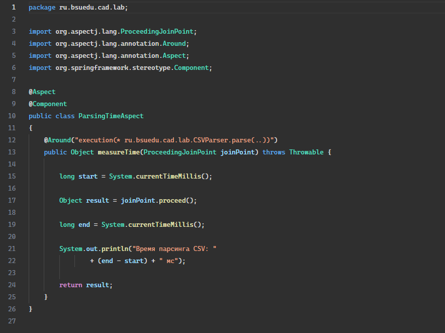
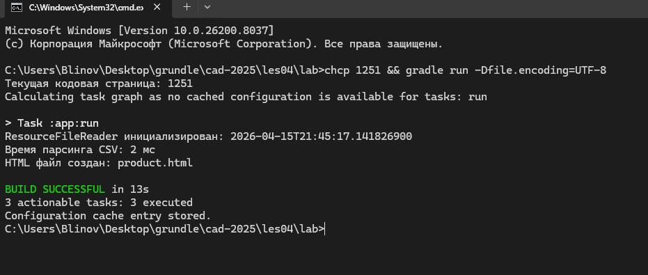
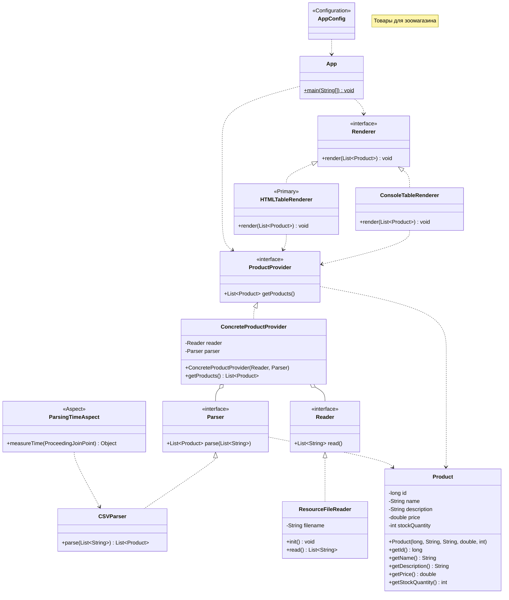

# Отчет о лаботаротоной работе №1

## Цель работы

В данной работе необходимо перейти на новое, более простое конфигурирование приложения с помощью аннотаций, добавить функционал по представлению таблиц в виде HTML и измерить скорость выполнения нашего кода c помощью инструментов АОП.

## Выполнение работы

В ходе работы были выполнены следующие действия:

<!-- 1. Переделайте приложение так, чтобы его конфигурирование осуществлялось с помощью аннотаций `@Component`

2. Использую аннотацию `@Value` и SpEL сделайте так, чтобы имя файла для загрузки продуктов, приложение получало из конфигурационного файла `application.properties`. Данный файл поместите в каталог ресурсов `(src/main/resources)`

 -->

1. Добавьте еще одну имплементацию интерфейса Renderer - `HTMLTableRenderer`которая выводит таблицу в HTML-файл. Сделайте так, чтобы при работе приложения вызывалась эта реализация, а не `ConsoleTableRenderer`.

2. С помощью событий жизненного цикла бина, выведите в консоль дату и время, когда бин `ResourceFileReader` был полностью инициализирован.

3. С помощью инструментов AOП замерьте сколько времени тратиться на парсинг CSV файла.

4. Приложение должно запускаться с помощью команды `gradle run`, выводить необходимую информацию в консоль и успешно завершаться.

5. Оформите отчет о выполнении лабораторной работы в виде файла `README.md` в директории `les04/lab`. Отчет должен содержать обновленную UML-диаграмму классов в формате `mermaid`.

## Выводы

В ходе выполнения работы произошел переход на новое, более простое конфигурирование приложения с помощью аннотаций, добавлен функционал по представлению таблиц в виде HTML и была измерена скорость выполнения кода c помощью инструментов АОП.
