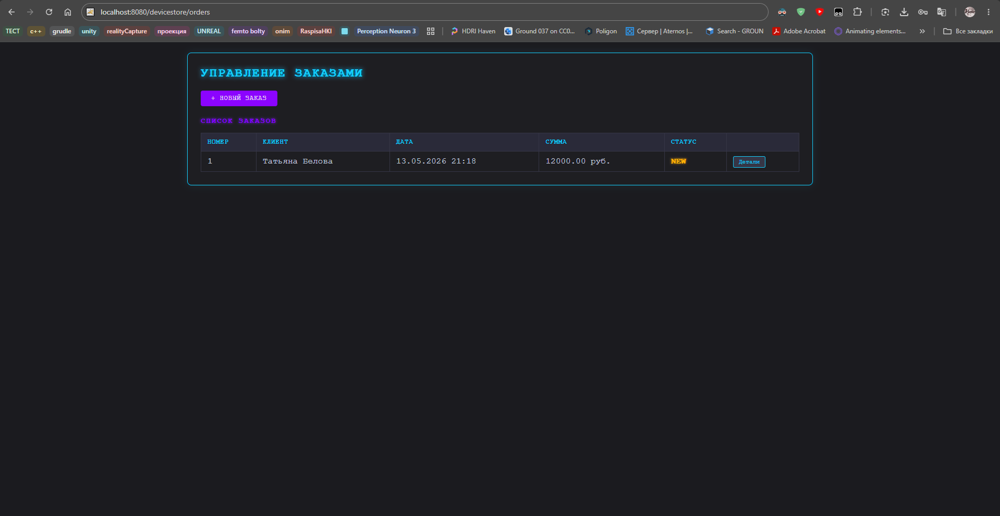
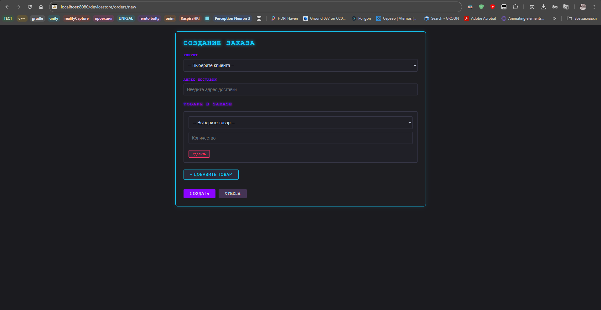
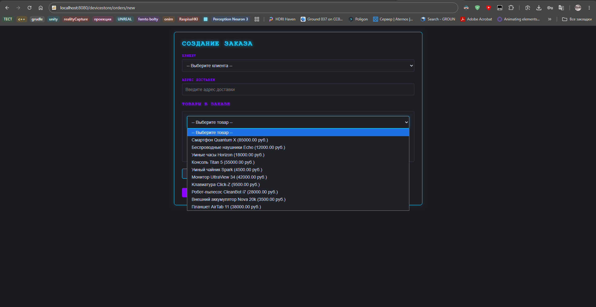
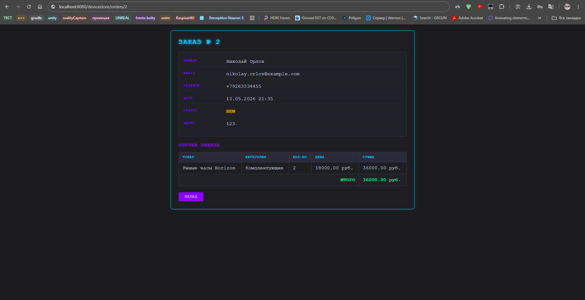
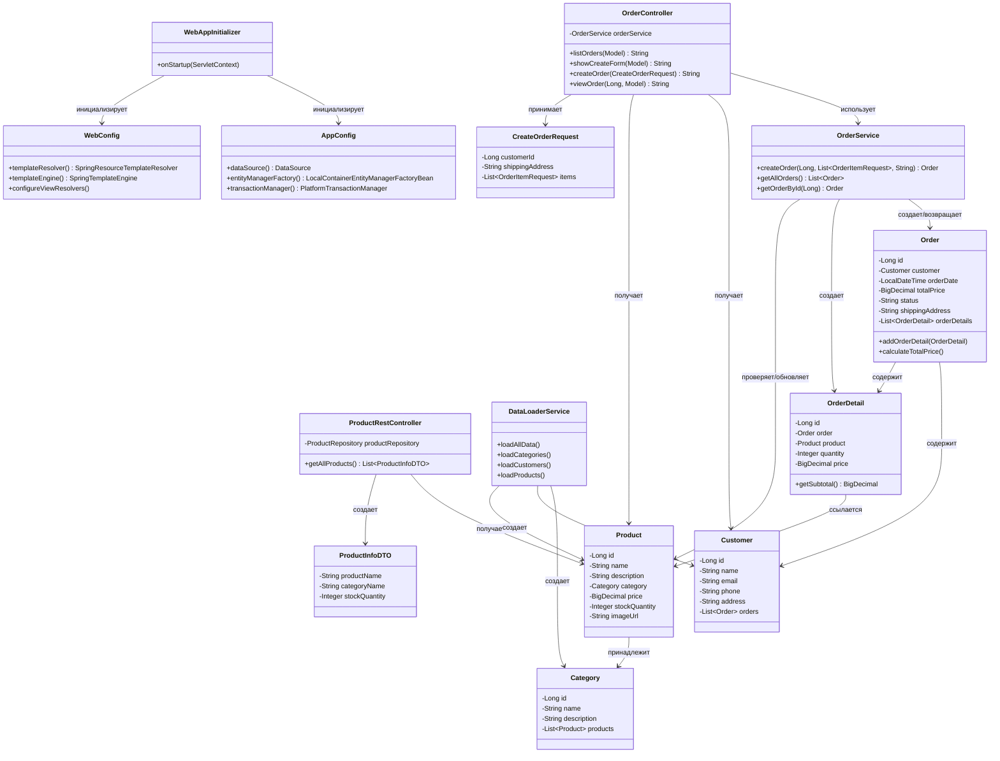

# Отчет по лабораторной работе №5

## Выполнение работы

Добавлен класс `WebAppInitializer` — реализация интерфейса `WebApplicationInitializer`, который регистрирует корневой контекст Spring (`AppConfig`) и веб-контекст (`WebConfig`) с `DispatcherServlet`, замапленным на `/`.

```
package ru.bsuedu.cad.lab.config;

import jakarta.servlet.ServletContext;
import jakarta.servlet.ServletException;
import jakarta.servlet.ServletRegistration;
import org.springframework.web.WebApplicationInitializer;
import org.springframework.web.context.ContextLoaderListener;
import org.springframework.web.context.support.AnnotationConfigWebApplicationContext;
import org.springframework.web.servlet.DispatcherServlet;

public class WebAppInitializer implements WebApplicationInitializer {

    @Override
    public void onStartup(ServletContext servletContext) throws ServletException {
        AnnotationConfigWebApplicationContext rootContext = new AnnotationConfigWebApplicationContext();
        rootContext.register(AppConfig.class);

        servletContext.addListener(new ContextLoaderListener(rootContext));

        AnnotationConfigWebApplicationContext webContext = new AnnotationConfigWebApplicationContext();
        webContext.register(WebConfig.class);

        ServletRegistration.Dynamic dispatcher = servletContext.addServlet("dispatcher",
                new DispatcherServlet(webContext));
        dispatcher.setLoadOnStartup(1);
        dispatcher.addMapping("/");

    }
}
```

Добавлен класс `OrderController` — обрабатывает HTTP-запросы по пути `/orders`:

- `GET /orders` — список всех заказов
- `GET /orders/new` — форма создания заказа
- `POST /orders` — создание нового заказа
- `GET /orders/{id}` — детали конкретного заказа

```
@Controller
@RequestMapping("/orders")
public class OrderController {
    private static final Logger logger = LoggerFactory.getLogger(OrderController.class);

    private final OrderService orderService;
    private final CustomerRepository customerRepository;
    private final ProductRepository productRepository;

    public OrderController(OrderService orderService,
                           CustomerRepository customerRepository,
                           ProductRepository productRepository) {
        this.orderService = orderService;
        this.customerRepository = customerRepository;
        this.productRepository = productRepository;
    }

    @GetMapping
    @Transactional(readOnly = true)
    public String listOrders(Model model) {
        List<Order> orders = orderService.getAllOrders();
        model.addAttribute("orders", orders);
        return "order-list";
    }

    @GetMapping("/new")
    @Transactional(readOnly = true)
    public String showCreateForm(Model model, @RequestParam(required = false) String error) {
        logger.info("Отображение формы создания заказа");

        List<Customer> customers = customerRepository.findAll();
        List<Product> products = productRepository.findAll();

        model.addAttribute("customers", customers);
        model.addAttribute("products", products);

        CreateOrderRequest orderRequest = new CreateOrderRequest();
        List<CreateOrderRequest.OrderItemRequest> items = new ArrayList<>();
        items.add(new CreateOrderRequest.OrderItemRequest());
        orderRequest.setItems(items);

        model.addAttribute("orderRequest", orderRequest);

        if (error != null) {
            model.addAttribute("errorMessage", "Добавьте хотя бы один товар в заказ");
        }

        return "order-form";
    }

    @PostMapping
    @Transactional
    public String createOrder(@ModelAttribute CreateOrderRequest orderRequest) {
        logger.info("Создание заказа: customerId={}, address={}",
                orderRequest.getCustomerId(), orderRequest.getShippingAddress());

        if (orderRequest.getItems() == null || orderRequest.getItems().isEmpty()) {
            logger.error("Список товаров пуст!");
            return "redirect:/orders/new?error=empty";
        }

        List<OrderService.OrderItemRequest> items = orderRequest.getItems().stream()
                .map(item -> new OrderService.OrderItemRequest(item.getProductId(), item.getQuantity()))
                .toList();

        orderService.createOrder(
                orderRequest.getCustomerId(),
                items,
                orderRequest.getShippingAddress()
        );

        return "redirect:/orders";
    }

    @GetMapping("/{id}")
    @Transactional(readOnly = true)
    public String viewOrder(@PathVariable Long id, Model model) {
        Order order = orderService.getOrderById(id);
        model.addAttribute("order", order);
        return "order-detail";
    }
}
```

Добавлен класс `ProductRestController` — REST-контроллер по пути `/api/products`, возвращает список продуктов в формате JSON через `ProductInfoDTO`.

```
@RestController
@RequestMapping("/api/products")
public class ProductRestController {
    private static final Logger logger = LoggerFactory.getLogger(ProductRestController.class);

    private final ProductRepository productRepository;

    public ProductRestController(ProductRepository productRepository) {
        this.productRepository = productRepository;
    }

    @GetMapping
    @Transactional(readOnly = true)
    public List<ProductInfoDTO> getAllProducts() {
        logger.info("REST запрос: получение всех продуктов");

        List<Product> products = productRepository.findAll();
        logger.info("Найдено продуктов: {}", products.size());

        return products.stream()
                .map(product -> {
                    String productName = product.getName();

                    String categoryName = "Без категории";
                    if (product.getCategory() != null) {
                        org.hibernate.Hibernate.initialize(product.getCategory());
                        categoryName = product.getCategory().getName();
                    }

                    Integer stockQuantity = product.getStockQuantity();

                    logger.debug("Товар: {}, категория: {}", productName, categoryName);

                    return new ProductInfoDTO(productName, categoryName, stockQuantity);
                })
                .collect(Collectors.toList());
    }
}
```

Добавлен класс `CreateOrderRequest` — DTO для приёма данных формы создания заказа, содержит `customerId`, `shippingAddress` и список `OrderItemRequest`.

```
package ru.bsuedu.cad.lab.dto;

import java.util.List;

public class CreateOrderRequest {
    private Long customerId;
    private String shippingAddress;
    private List<OrderItemRequest> items;

    public static class OrderItemRequest {
        private Long productId;
        private Integer quantity;

        public Long getProductId() { return productId; }
        public void setProductId(Long productId) { this.productId = productId; }

        public Integer getQuantity() { return quantity; }
        public void setQuantity(Integer quantity) { this.quantity = quantity; }
    }

    public Long getCustomerId() { return customerId; }
    public void setCustomerId(Long customerId) { this.customerId = customerId; }

    public String getShippingAddress() { return shippingAddress; }
    public void setShippingAddress(String shippingAddress) { this.shippingAddress = shippingAddress; }

    public List<OrderItemRequest> getItems() { return items; }
    public void setItems(List<OrderItemRequest> items) { this.items = items; }
}
```

Добавлен класс `ProductInfoDTO` — DTO для передачи данных о продукте через REST API: название, категория, остаток на складе.

```
package ru.bsuedu.cad.lab.dto;

public class ProductInfoDTO {
    private String productName;
    private String categoryName;
    private Integer stockQuantity;

    public ProductInfoDTO(String productName, String categoryName, Integer stockQuantity) {
        this.productName = productName;
        this.categoryName = categoryName;
        this.stockQuantity = stockQuantity;
    }

    public String getProductName() { return productName; }
    public void setProductName(String productName) { this.productName = productName; }

    public String getCategoryName() { return categoryName; }
    public void setCategoryName(String categoryName) { this.categoryName = categoryName; }

    public Integer getStockQuantity() { return stockQuantity; }
    public void setStockQuantity(Integer stockQuantity) { this.stockQuantity = stockQuantity; }
}
```

Репозитории переведены на Spring Data JPA: интерфейсы `CategoryRepository`, `CustomerRepository`, `ProductRepository`, `OrderRepository`, `OrderDetailRepository` теперь наследуют `JpaRepository`, что исключает ручную реализацию CRUD-операций.

В `AppConfig` настроен `LocalContainerEntityManagerFactoryBean` с Hibernate в качестве JPA-провайдера и HikariCP для пула соединений.

```
package ru.bsuedu.cad.lab.config;

import com.zaxxer.hikari.HikariConfig;
import com.zaxxer.hikari.HikariDataSource;
import org.springframework.context.annotation.Bean;
import org.springframework.context.annotation.ComponentScan;
import org.springframework.context.annotation.Configuration;
import org.springframework.context.annotation.PropertySource;
import org.springframework.core.env.Environment;
import org.springframework.data.jpa.repository.config.EnableJpaRepositories;
import org.springframework.orm.jpa.JpaTransactionManager;
import org.springframework.orm.jpa.LocalContainerEntityManagerFactoryBean;
import org.springframework.orm.jpa.vendor.HibernateJpaVendorAdapter;
import org.springframework.transaction.PlatformTransactionManager;
import org.springframework.transaction.annotation.EnableTransactionManagement;

import javax.sql.DataSource;
import java.util.Properties;

@Configuration
@ComponentScan("ru.bsuedu.cad.lab")
@EnableTransactionManagement
@EnableJpaRepositories(basePackages = "ru.bsuedu.cad.lab.repository")
@PropertySource("classpath:application.properties")
public class AppConfig {

    private final Environment env;

    public AppConfig(Environment env) {
        this.env = env;
    }

    @Bean
    public DataSource dataSource() {
        HikariConfig config = new HikariConfig();
        config.setJdbcUrl(env.getProperty("spring.datasource.url"));
        config.setUsername(env.getProperty("spring.datasource.username"));
        config.setPassword(env.getProperty("spring.datasource.password"));
        config.setDriverClassName(env.getProperty("spring.datasource.driver-class-name"));

        config.setMaximumPoolSize(env.getProperty("spring.datasource.hikari.maximum-pool-size", Integer.class, 10));
        config.setMinimumIdle(env.getProperty("spring.datasource.hikari.minimum-idle", Integer.class, 5));
        config.setIdleTimeout(env.getProperty("spring.datasource.hikari.idle-timeout", Long.class, 30000L));
        config.setConnectionTimeout(env.getProperty("spring.datasource.hikari.connection-timeout", Long.class, 30000L));

        return new HikariDataSource(config);
    }

    @Bean
    public LocalContainerEntityManagerFactoryBean entityManagerFactory() {
        LocalContainerEntityManagerFactoryBean em = new LocalContainerEntityManagerFactoryBean();
        em.setDataSource(dataSource());
        em.setPackagesToScan("ru.bsuedu.cad.lab.entity");

        HibernateJpaVendorAdapter vendorAdapter = new HibernateJpaVendorAdapter();
        em.setJpaVendorAdapter(vendorAdapter);

        Properties properties = new Properties();
        properties.setProperty("hibernate.hbm2ddl.auto", env.getProperty("spring.jpa.hibernate.ddl-auto", "create-drop"));
        properties.setProperty("hibernate.dialect", env.getProperty("spring.jpa.properties.hibernate.dialect"));
        properties.setProperty("hibernate.show_sql", env.getProperty("spring.jpa.show-sql", "true"));
        properties.setProperty("hibernate.format_sql", env.getProperty("spring.jpa.properties.hibernate.format_sql", "true"));

        em.setJpaProperties(properties);

        return em;
    }

    @Bean
    public PlatformTransactionManager transactionManager() {
        JpaTransactionManager transactionManager = new JpaTransactionManager();
        transactionManager.setEntityManagerFactory(entityManagerFactory().getObject());
        return transactionManager;
    }
}
```

Добавлены три HTML-шаблона:

- `order-list.html` — таблица всех заказов с номером, клиентом, датой, суммой, статусом и ссылкой на детали
- `order-form.html` — форма создания заказа с выбором клиента, адресом доставки и динамическим добавлением/удалением товаров через JavaScript
- `order-detail.html` — детали заказа: информация о клиенте, состав заказа с ценами и итоговая сумма

Приложение собирается командой:

```
gradle war
```

Итоговый файл `zoostore.war` копируется в директорию `webapps/` сервера Apache Tomcat 11 и запускается через `startup.bat`.

Результат работы









Диаграмма классов


