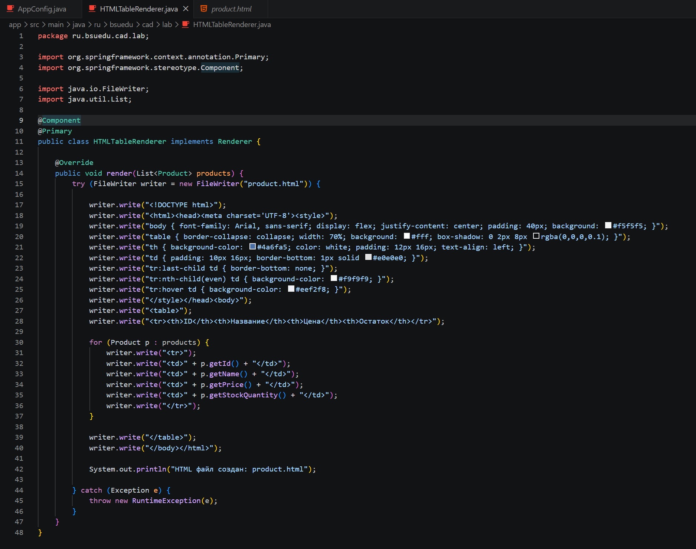
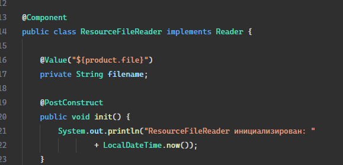
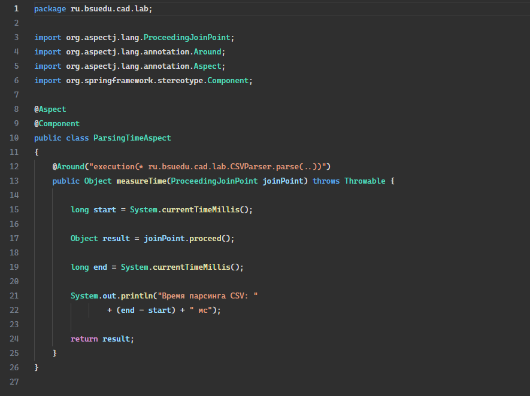
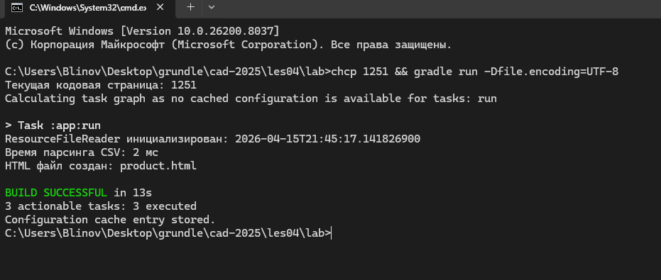
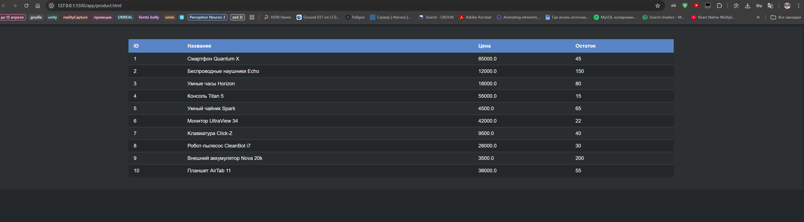
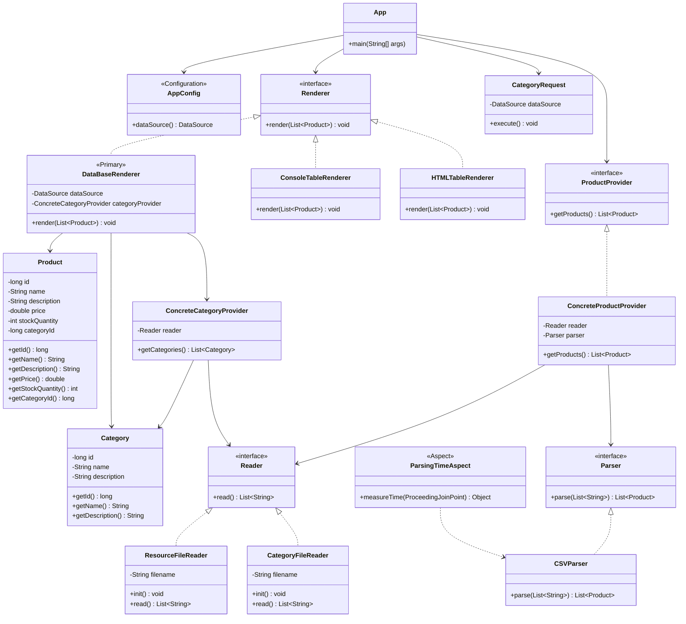

# Отчет о лабораторной работе №3

## Цель работы

В данной работе необходимо добавить поддержку базы данных H2, реализовать сохранение категорий и продуктов через JDBC, а также выполнить SQL-запрос для получения статистики по категориям.

## Выполнение работы

В ходе работы были выполнены следующие действия:

1. Добавлен новый класс `CategoryFileReader` — реализация интерфейса `Reader` для чтения категорий из файла. Выводит дату и время инициализации через `@PostConstruct`.

2. Добавлен новый класс `ConcreteCategoryProvider` — считывает строки из файла категорий и преобразует их в список объектов `Category`.

3. Добавлен новый класс `DataBaseRenderer` — реализация интерфейса `Renderer` с аннотацией `@Primary`. Сохраняет категории и продукты в встроенную базу данных H2 через JDBC batch-insert.

4. Добавлен новый класс `CategoryRequest` — выполняет SQL-запрос к H2, выбирая категории с количеством товаров больше одного, и выводит результат через `logger.info`.

5. Приложение запускается командой `gradle run`, сохраняет данные в H2 и выводит статистику по категориям в консоль.

6. Оформлен отчет о выполнении лабораторной работы в виде файла `README.md` в директории `les06/lab`. Отчет содержит обновленную UML-диаграмму классов в формате `mermaid`.

## Выводы

В ходе выполнения работы была добавлена поддержка встроенной базы данных H2, реализовано сохранение категорий и продуктов через JDBC с использованием batch-insert, а также выполнен SQL-запрос для получения статистики по категориям с количеством товаров больше одного.
