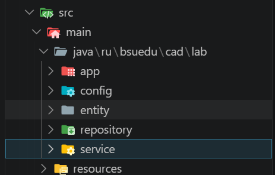
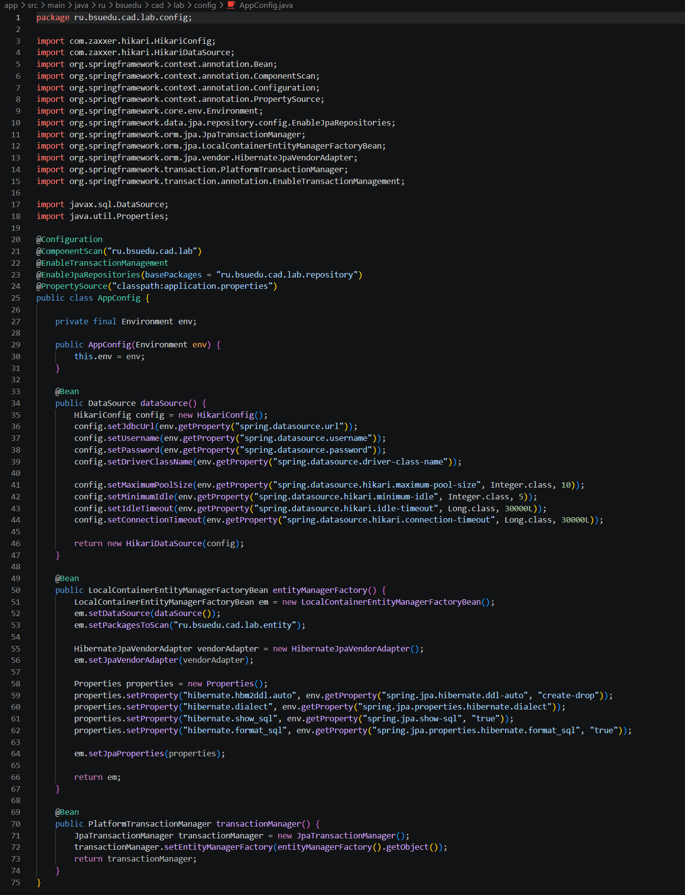
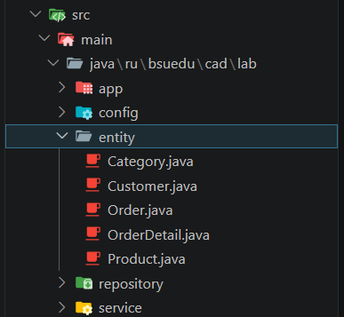
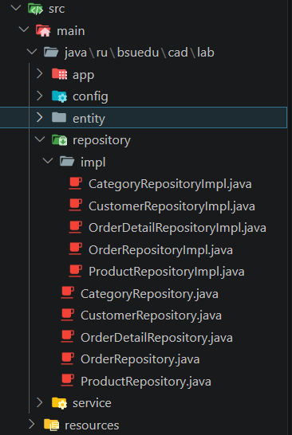
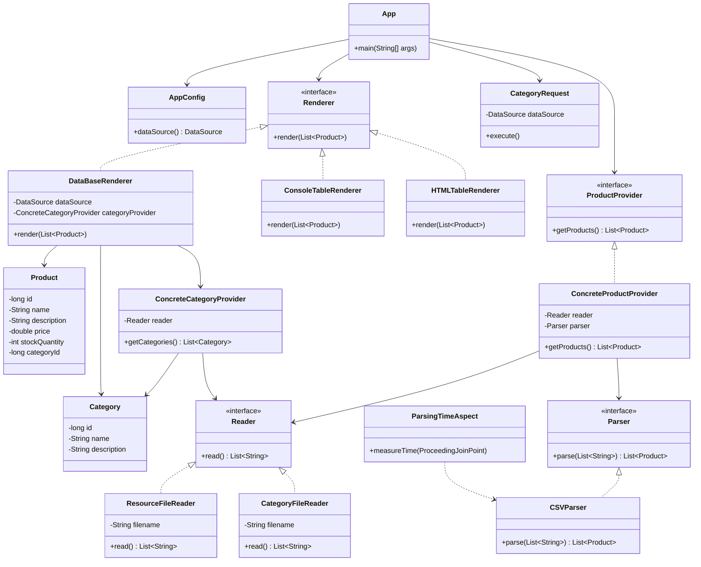

# Отчет о лабораторной работе №4
 
## Цель работы
 
Выполнить рефакторинг проекта магазина зоотоваров: перейти с Spring JDBC на ORM Hibernate и Spring Data JPA, расширить приложение новыми сущностями и привести структуру в соответствие со слоистой архитектурой.

## Выполнение работы

1. Проект организован в соответствии со слоистой архитектурой



2. В классе `AppConfig` настроен `HikariDataSource` с базой данных H2 в памяти, а также `LocalContainerEntityManagerFactoryBean` для работы с Hibernate. Схема базы данных создаётся автоматически на основе JPA-аннотаций `hibernate.hbm2ddl.auto=create-drop`



3. В пакете `ru.bsuedu.cad.lab.entity` созданы следующие сущности



4. В пакете `ru.bsuedu.cad.lab.repository` определены интерфейсы для каждой сущности с методами `save`, `findById`, `findAll` и дополнительными методами поиска. Реализации в подпакете `impl` используют `EntityManager` напрямую через `@PersistenceContext`



5. В пакете `ru.bsuedu.cad.lab.service` реализованы два сервиса

- **DataLoaderService** — загружает начальные данные из CSV-файлов (`category.csv`, `customer.csv`, `product.csv`) в транзакции через `@Transactional`.
- **OrderService** — создаёт заказ в рамках транзакции: проверяет наличие товара, сохраняет `Order` и `OrderDetail`, обновляет остатки на складе. Также предоставляет метод получения всех заказов.

6. Класс `OrderApplication` 

- Загружает данные из CSV через `DataLoaderService`
- Выводит список категорий, покупателей и товаров
- Создаёт новый заказ для покупателя Артём Захаров (товары: Монитор UltraView 34 x1, Клавиатура Click-Z x2, Аккумулятор Nova 20k x3)
- Выводит информацию о созданном заказе
- Проверяет сохранение заказа, получая все заказы из БД
- Показывает обновлённые остатки товаров на складе
Создание заказа выполняется в рамках транзакции (`@Transactional` в `OrderService`).

7. Результат

```
> Task :app:run
17:23:30 [INFO ] ==========================================
17:23:30 [INFO ] Запуск приложения
17:23:30 [INFO ] ==========================================
Hibernate:
    drop table if exists CATEGORIES cascade
Hibernate:
    drop table if exists CUSTOMERS cascade
Hibernate:
    drop table if exists ORDER_DETAILS cascade
Hibernate:
    drop table if exists ORDERS cascade
Hibernate:
    drop table if exists PRODUCTS cascade
Hibernate:
    create table CATEGORIES (
        category_id bigint generated by default as identity,
        name varchar(100) not null,
        description varchar(500),
        primary key (category_id)
    )
Hibernate:
    create table CUSTOMERS (
        customer_id bigint generated by default as identity,
        phone varchar(20),
        email varchar(100) not null unique,
        name varchar(100) not null,
        address varchar(500),
        primary key (customer_id)
    )
Hibernate:
    create table ORDER_DETAILS (
        price numeric(10,2) not null,
        quantity integer not null,
        order_detail_id bigint generated by default as identity,
        order_id bigint not null,
        product_id bigint not null,
        primary key (order_detail_id)
    )
Hibernate:
    create table ORDERS (
        total_price numeric(10,2) not null,
        customer_id bigint not null,
        order_date timestamp(6) not null,
        order_id bigint generated by default as identity,
        status varchar(50) not null,
        shipping_address varchar(500),
        primary key (order_id)
    )
Hibernate:
    create table PRODUCTS (
        price numeric(10,2) not null,
        stock_quantity integer not null,
        category_id bigint not null,
        created_at timestamp(6),
        product_id bigint generated by default as identity,
        updated_at timestamp(6),
        name varchar(200) not null,
        image_url varchar(500),
        description varchar(1000),
        primary key (product_id)
    )
Hibernate:
    alter table if exists ORDER_DETAILS
       add constraint FK8wdku4h4c96gwubj09an8bby6
       foreign key (order_id)
       references ORDERS
Hibernate:
    alter table if exists ORDER_DETAILS
       add constraint FKpshg2yc6vr6npa8jkbryetxrx
       foreign key (product_id)
       references PRODUCTS
Hibernate:
    alter table if exists ORDERS
       add constraint FK1nbewmmir6psft27yfvvmwpfg
       foreign key (customer_id)
       references CUSTOMERS
Hibernate:
    alter table if exists PRODUCTS
       add constraint FK860uwmfahxkeahlm8a800vmnb
       foreign key (category_id)
       references CATEGORIES
17:23:32 [INFO ] Загрузка начальных данных из CSV файлов...
17:23:32 [INFO ] Загрузка CSV-файлов...
17:23:32 [INFO ] Загрузка категорий...
Hibernate:
    insert
    into
        CATEGORIES
        (description, name, category_id)
    values
        (?, ?, default)
Hibernate:
    insert
    into
        CATEGORIES
        (description, name, category_id)
    values
        (?, ?, default)
Hibernate:
    insert
    into
        CATEGORIES
        (description, name, category_id)
    values
        (?, ?, default)
Hibernate:
    insert
    into
        CATEGORIES
        (description, name, category_id)
    values
        (?, ?, default)
Hibernate:
    insert
    into
        CATEGORIES
        (description, name, category_id)
    values
        (?, ?, default)
Hibernate:
    insert
    into
        CATEGORIES
        (description, name, category_id)
    values
        (?, ?, default)
Hibernate:
    insert
    into
        CATEGORIES
        (description, name, category_id)
    values
        (?, ?, default)
Hibernate:
    insert
    into
        CATEGORIES
        (description, name, category_id)
    values
        (?, ?, default)
Hibernate:
    insert
    into
        CATEGORIES
        (description, name, category_id)
    values
        (?, ?, default)
Hibernate:
    insert
    into
        CATEGORIES
        (description, name, category_id)
    values
        (?, ?, default)
17:23:32 [INFO ] Загружены 10 категорий
17:23:32 [INFO ] Загрузка покупателей...
Hibernate:
    insert
    into
        CUSTOMERS
        (address, email, name, phone, customer_id)
    values
        (?, ?, ?, ?, default)
Hibernate:
    insert
    into
        CUSTOMERS
        (address, email, name, phone, customer_id)
    values
        (?, ?, ?, ?, default)
Hibernate:
    insert
    into
        CUSTOMERS
        (address, email, name, phone, customer_id)
    values
        (?, ?, ?, ?, default)
Hibernate:
    insert
    into
        CUSTOMERS
        (address, email, name, phone, customer_id)
    values
        (?, ?, ?, ?, default)
Hibernate:
    insert
    into
        CUSTOMERS
        (address, email, name, phone, customer_id)
    values
        (?, ?, ?, ?, default)
Hibernate:
    insert
    into
        CUSTOMERS
        (address, email, name, phone, customer_id)
    values
        (?, ?, ?, ?, default)
Hibernate:
    insert
    into
        CUSTOMERS
        (address, email, name, phone, customer_id)
    values
        (?, ?, ?, ?, default)
Hibernate:
    insert
    into
        CUSTOMERS
        (address, email, name, phone, customer_id)
    values
        (?, ?, ?, ?, default)
Hibernate:
    insert
    into
        CUSTOMERS
        (address, email, name, phone, customer_id)
    values
        (?, ?, ?, ?, default)
Hibernate:
    insert
    into
        CUSTOMERS
        (address, email, name, phone, customer_id)
    values
        (?, ?, ?, ?, default)
17:23:32 [INFO ] Загружено 10 покупателей
17:23:32 [INFO ] Загрузка товаров...
Hibernate:
    insert
    into
        PRODUCTS
        (category_id, created_at, description, image_url, name, price, stock_quantity, updated_at, product_id)
    values
        (?, ?, ?, ?, ?, ?, ?, ?, default)
Hibernate:
    insert
    into
        PRODUCTS
        (category_id, created_at, description, image_url, name, price, stock_quantity, updated_at, product_id)
    values
        (?, ?, ?, ?, ?, ?, ?, ?, default)
Hibernate:
    insert
    into
        PRODUCTS
        (category_id, created_at, description, image_url, name, price, stock_quantity, updated_at, product_id)
    values
        (?, ?, ?, ?, ?, ?, ?, ?, default)
Hibernate:
    insert
    into
        PRODUCTS
        (category_id, created_at, description, image_url, name, price, stock_quantity, updated_at, product_id)
    values
        (?, ?, ?, ?, ?, ?, ?, ?, default)
Hibernate:
    insert
    into
        PRODUCTS
        (category_id, created_at, description, image_url, name, price, stock_quantity, updated_at, product_id)
    values
        (?, ?, ?, ?, ?, ?, ?, ?, default)
Hibernate:
    insert
    into
        PRODUCTS
        (category_id, created_at, description, image_url, name, price, stock_quantity, updated_at, product_id)
    values
        (?, ?, ?, ?, ?, ?, ?, ?, default)
Hibernate:
    insert
    into
        PRODUCTS
        (category_id, created_at, description, image_url, name, price, stock_quantity, updated_at, product_id)
    values
        (?, ?, ?, ?, ?, ?, ?, ?, default)
Hibernate:
    insert
    into
        PRODUCTS
        (category_id, created_at, description, image_url, name, price, stock_quantity, updated_at, product_id)
    values
        (?, ?, ?, ?, ?, ?, ?, ?, default)
Hibernate:
    insert
    into
        PRODUCTS
        (category_id, created_at, description, image_url, name, price, stock_quantity, updated_at, product_id)
    values
        (?, ?, ?, ?, ?, ?, ?, ?, default)
Hibernate:
    insert
    into
        PRODUCTS
        (category_id, created_at, description, image_url, name, price, stock_quantity, updated_at, product_id)
    values
        (?, ?, ?, ?, ?, ?, ?, ?, default)
17:23:32 [INFO ] Записано 10 продуктов
17:23:32 [INFO ] Загрузка данных успешно выполнена
17:23:32 [INFO ] ==========================================
17:23:32 [INFO ] ЗАГРУЖЕННЫЕ ДАННЫЕ:
17:23:32 [INFO ] ==========================================
Hibernate:
    select
        c1_0.category_id,
        c1_0.description,
        c1_0.name
    from
        CATEGORIES c1_0
17:23:33 [INFO ] Категории (10):
17:23:33 [INFO ]   1 - Компьютеры
17:23:33 [INFO ]   2 - Ноутбуки
17:23:33 [INFO ]   3 - Комплектующие
17:23:33 [INFO ]   4 - Периферия
17:23:33 [INFO ]   5 - Мониторы
17:23:33 [INFO ]   6 - Хранение данных
17:23:33 [INFO ]   7 - Сетевое оборудование
17:23:33 [INFO ]   8 - Аксессуары
17:23:33 [INFO ]   9 - Игровые устройства
17:23:33 [INFO ]   10 - Программное обеспечение
Hibernate:
    select
        c1_0.customer_id,
        c1_0.address,
        c1_0.email,
        c1_0.name,
        c1_0.phone
    from
        CUSTOMERS c1_0
17:23:33 [INFO ] Клиенты (10):
17:23:33 [INFO ]   1 - Николай Орлов (nikolay.orlov@example.com)
17:23:33 [INFO ]   2 - Татьяна Белова (tatyana.belova@example.com)
17:23:33 [INFO ]   3 - Артем Захаров (artem.zakharov@example.com)
17:23:33 [INFO ]   4 - Светлана Громова (svetlana.gromova@example.com)
17:23:33 [INFO ]   5 - Кирилл Новиков (kirill.novikov@example.com)
17:23:33 [INFO ]   6 - Юлия Денисова (yulia.denisova@example.com)
17:23:33 [INFO ]   7 - Максим Егоров (maksim.egorov@example.com)
17:23:33 [INFO ]   8 - Дарья Ковалева (darya.kovaleva@example.com)
17:23:33 [INFO ]   9 - Роман Лебедев (roman.lebedev@example.com)
17:23:33 [INFO ]   10 - Алина Жукова (alina.zhukova@example.com)
Hibernate:
    select
        p1_0.product_id,
        p1_0.category_id,
        p1_0.created_at,
        p1_0.description,
        p1_0.image_url,
        p1_0.name,
        p1_0.price,
        p1_0.stock_quantity,
        p1_0.updated_at
    from
        PRODUCTS p1_0
17:23:33 [INFO ] Товары (10):
17:23:33 [INFO ]   1 - Смартфон Quantum X (85000.00 руб.) - остаток: 45
17:23:33 [INFO ]   2 - Беспроводные наушники Echo (12000.00 руб.) - остаток: 150
17:23:33 [INFO ]   3 - Умные часы Horizon (18000.00 руб.) - остаток: 80
17:23:33 [INFO ]   4 - Консоль Titan 5 (55000.00 руб.) - остаток: 15
17:23:33 [INFO ]   5 - Умный чайник Spark (4500.00 руб.) - остаток: 65
17:23:33 [INFO ]   6 - Монитор UltraView 34 (42000.00 руб.) - остаток: 22
17:23:33 [INFO ]   7 - Kлавиатура Click-Z (9500.00 руб.) - остаток: 40
17:23:33 [INFO ]   8 - Робот-пылесос CleanBot i7 (28000.00 руб.) - остаток: 30
17:23:33 [INFO ]   9 - Внешний аккумулятор Nova 20k (3500.00 руб.) - остаток: 200
17:23:33 [INFO ]   10 - Планшет AirTab 11 (38000.00 руб.) - остаток: 55
17:23:33 [INFO ] ==========================================
17:23:33 [INFO ] СОЗДАНИЕ НОВОГО ЗАКАЗА:
17:23:33 [INFO ] ==========================================
17:23:33 [INFO ] Клиент: Николай Орлов (nikolay.orlov@example.com)
17:23:33 [INFO ] Адрес доставки: Москва
17:23:33 [INFO ] Состав заказа:
17:23:33 [INFO ]   - Смартфон Quantum X: 1 x 85000.00 руб. = 85000.00 руб.
17:23:33 [INFO ]   - Беспроводные наушники Echo: 2 x 12000.00 руб. = 24000.00 руб.
17:23:33 [INFO ]   - Умные часы Horizon: 1 x 18000.00 руб. = 18000.00 руб.
17:23:33 [INFO ] Создан новый заказ для покупателя с ID: 1
Hibernate:
    select
        c1_0.customer_id,
        c1_0.address,
        c1_0.email,
        c1_0.name,
        c1_0.phone
    from
        CUSTOMERS c1_0
    where
        c1_0.customer_id=?
Hibernate:
    insert
    into
        ORDERS
        (customer_id, order_date, shipping_address, status, total_price, order_id)
    values
        (?, ?, ?, ?, ?, default)
17:23:33 [INFO ] Создан заказ с ID: 1
Hibernate:
    select
        p1_0.product_id,
        p1_0.category_id,
        p1_0.created_at,
        p1_0.description,
        p1_0.image_url,
        p1_0.name,
        p1_0.price,
        p1_0.stock_quantity,
        p1_0.updated_at
    from
        PRODUCTS p1_0
    where
        p1_0.product_id=?
Hibernate:
    insert
    into
        ORDER_DETAILS
        (order_id, price, product_id, quantity, order_detail_id)
    values
        (?, ?, ?, ?, default)
Hibernate:
    select
        p1_0.product_id,
        p1_0.category_id,
        p1_0.created_at,
        p1_0.description,
        p1_0.image_url,
        p1_0.name,
        p1_0.price,
        p1_0.stock_quantity,
        p1_0.updated_at
    from
        PRODUCTS p1_0
    where
        p1_0.product_id=?
Hibernate:
    insert
    into
        ORDER_DETAILS
        (order_id, price, product_id, quantity, order_detail_id)
    values
        (?, ?, ?, ?, default)
Hibernate:
    select
        p1_0.product_id,
        p1_0.category_id,
        p1_0.created_at,
        p1_0.description,
        p1_0.image_url,
        p1_0.name,
        p1_0.price,
        p1_0.stock_quantity,
        p1_0.updated_at
    from
        PRODUCTS p1_0
    where
        p1_0.product_id=?
Hibernate:
    insert
    into
        ORDER_DETAILS
        (order_id, price, product_id, quantity, order_detail_id)
    values
        (?, ?, ?, ?, default)
17:23:33 [INFO ] Заказ успешен. Итоговая цена: 127000.00
Hibernate:
    update
        ORDERS
    set
        customer_id=?,
        order_date=?,
        shipping_address=?,
        status=?,
        total_price=?
    where
        order_id=?
Hibernate:
    update
        PRODUCTS
    set
        category_id=?,
        created_at=?,
        description=?,
        image_url=?,
        name=?,
        price=?,
        stock_quantity=?,
        updated_at=?
    where
        product_id=?
Hibernate:
    update
        PRODUCTS
    set
        category_id=?,
        created_at=?,
        description=?,
        image_url=?,
        name=?,
        price=?,
        stock_quantity=?,
        updated_at=?
    where
        product_id=?
Hibernate:
    update
        PRODUCTS
    set
        category_id=?,
        created_at=?,
        description=?,
        image_url=?,
        name=?,
        price=?,
        stock_quantity=?,
        updated_at=?
    where
        product_id=?
17:23:33 [INFO ] ==========================================
17:23:33 [INFO ] ЗАКАЗ УСПЕШНО СОЗДАН!
17:23:33 [INFO ] ==========================================
17:23:33 [INFO ] Номер заказа: 1
17:23:33 [INFO ] Дата заказа: 2026-05-12T17:23:33.276367900
17:23:33 [INFO ] Статус: NEW
17:23:33 [INFO ] Общая сумма: 127000.00 руб.
17:23:33 [INFO ] Клиент: Николай Орлов
17:23:33 [INFO ] Адрес доставки: Москва
17:23:33 [INFO ] Детали заказа:
17:23:33 [INFO ]   - Смартфон Quantum X: 1 x 85000.00 руб. = 85000.00 руб.
17:23:33 [INFO ]   - Беспроводные наушники Echo: 2 x 12000.00 руб. = 24000.00 руб.
17:23:33 [INFO ]   - Умные часы Horizon: 1 x 18000.00 руб. = 18000.00 руб.
17:23:33 [INFO ] ==========================================
17:23:33 [INFO ] ПРОВЕРКА СОХРАНЕНИЯ ЗАКАЗА:
17:23:33 [INFO ] ==========================================
17:23:33 [INFO ] Ищем все заказы
Hibernate:
    select
        distinct o1_0.order_id,
        o1_0.customer_id,
        o1_0.order_date,
        od1_0.order_id,
        od1_0.order_detail_id,
        od1_0.price,
        od1_0.product_id,
        p1_0.product_id,
        p1_0.category_id,
        p1_0.created_at,
        p1_0.description,
        p1_0.image_url,
        p1_0.name,
        p1_0.price,
        p1_0.stock_quantity,
        p1_0.updated_at,
        od1_0.quantity,
        o1_0.shipping_address,
        o1_0.status,
        o1_0.total_price
    from
        ORDERS o1_0
    left join
        ORDER_DETAILS od1_0
            on o1_0.order_id=od1_0.order_id
    left join
        PRODUCTS p1_0
            on p1_0.product_id=od1_0.product_id
17:23:33 [INFO ] Найдено 1 заказов
17:23:33 [INFO ] Всего заказов в базе данных: 1
17:23:33 [INFO ] Заказ #1 от 2026-05-12T17:23:33.276368 на сумму 127000.00 руб. (NEW):
17:23:33 [INFO ]     - Смартфон Quantum X: 1 x 85000.00 руб.
17:23:33 [INFO ]     - Беспроводные наушники Echo: 2 x 12000.00 руб.
17:23:33 [INFO ]     - Умные часы Horizon: 1 x 18000.00 руб.
17:23:33 [INFO ] ==========================================
17:23:33 [INFO ] ОБНОВЛЕНИЕ ОСТАТКОВ ТОВАРОВ:
17:23:33 [INFO ] ==========================================
Hibernate:
    select
        p1_0.product_id,
        p1_0.category_id,
        p1_0.created_at,
        p1_0.description,
        p1_0.image_url,
        p1_0.name,
        p1_0.price,
        p1_0.stock_quantity,
        p1_0.updated_at
    from
        PRODUCTS p1_0
17:23:33 [INFO ] Товар 'Смартфон Quantum X': новый остаток = 44
17:23:33 [INFO ] Товар 'Беспроводные наушники Echo': новый остаток = 148
17:23:33 [INFO ] Товар 'Умные часы Horizon': новый остаток = 79
17:23:33 [INFO ] Товар 'Консоль Titan 5': новый остаток = 15
17:23:33 [INFO ] Товар 'Умный чайник Spark': новый остаток = 65
17:23:33 [INFO ] Товар 'Монитор UltraView 34': новый остаток = 22
17:23:33 [INFO ] Товар 'Kлавиатура Click-Z': новый остаток = 40
17:23:33 [INFO ] Товар 'Робот-пылесос CleanBot i7': новый остаток = 30
17:23:33 [INFO ] Товар 'Внешний аккумулятор Nova 20k': новый остаток = 200
17:23:33 [INFO ] Товар 'Планшет AirTab 11': новый остаток = 55
17:23:33 [INFO ] ==========================================
17:23:33 [INFO ] Приложение успешно завершено!
17:23:33 [INFO ] ==========================================
Hibernate:
    drop table if exists CATEGORIES cascade
Hibernate:
    drop table if exists CUSTOMERS cascade
Hibernate:
    drop table if exists ORDER_DETAILS cascade
Hibernate:
    drop table if exists ORDERS cascade
Hibernate:
    drop table if exists PRODUCTS cascade

BUILD SUCCESSFUL in 25s
3 actionable tasks: 3 executed
Configuration cache entry stored.
C:\Users\PC\Desktop\grudle\cad-2025\les08\lab>
```

8. UML-диаграмма классов



## Выводы
 
В ходе выполнения лабораторной работы приложение было переведено с Spring JDBC на Hibernate/JPA. Создана полная схема базы данных из пяти связанных таблиц. Данные загружаются из CSV-файлов, заказ успешно сохраняется в H2 и подтверждается повторным чтением из базы.
