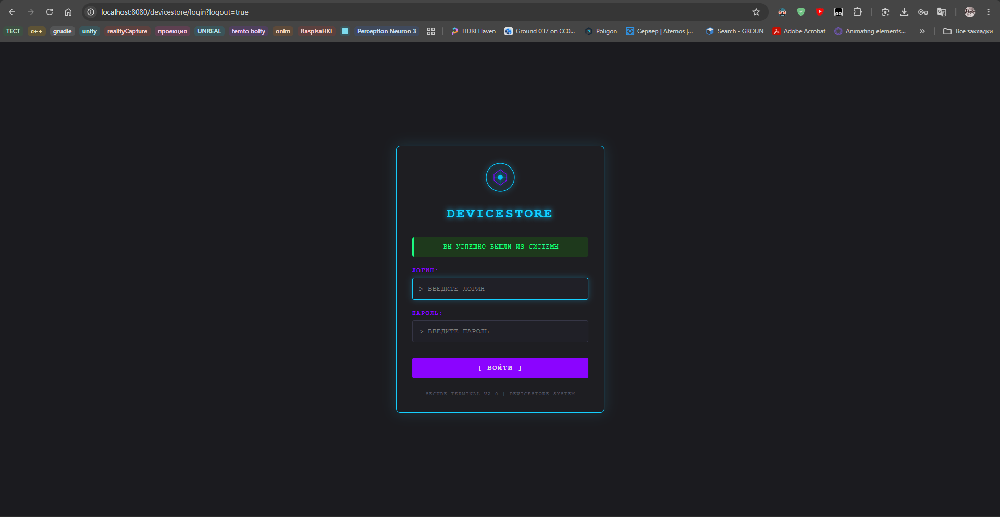
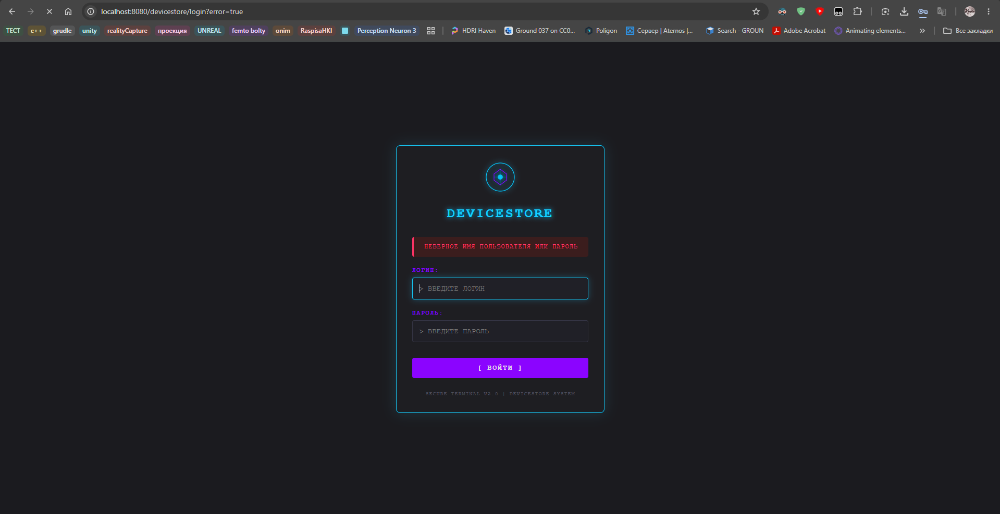
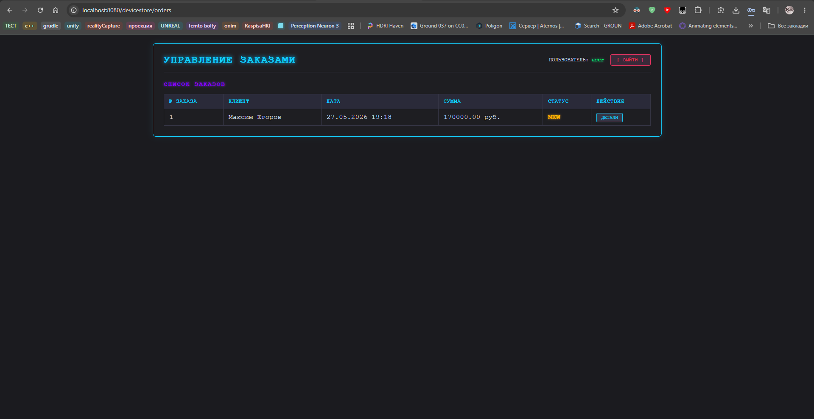

# Отчет по лабораторной работе №7

## Выполнение работы

1. Класс SecurityConfig

```
package ru.bsuedu.cad.lab.config;

import org.springframework.context.annotation.Bean;
import org.springframework.context.annotation.Configuration;
import org.springframework.core.annotation.Order;
import org.springframework.security.config.annotation.web.builders.HttpSecurity;
import org.springframework.security.config.annotation.web.configuration.EnableWebSecurity;
import org.springframework.security.config.annotation.web.configurers.AbstractHttpConfigurer;
import org.springframework.security.config.annotation.web.configurers.HeadersConfigurer;
import org.springframework.security.core.userdetails.User;
import org.springframework.security.core.userdetails.UserDetails;
import org.springframework.security.core.userdetails.UserDetailsService;
import org.springframework.security.crypto.bcrypt.BCryptPasswordEncoder;
import org.springframework.security.crypto.password.PasswordEncoder;
import org.springframework.security.provisioning.InMemoryUserDetailsManager;
import org.springframework.security.web.SecurityFilterChain;

import static org.springframework.security.config.Customizer.withDefaults;

@Configuration
@EnableWebSecurity
public class SecurityConfig {

    @Bean
    public PasswordEncoder passwordEncoder() {
        return new BCryptPasswordEncoder();
    }

    @Bean
    public UserDetailsService userDetailsService() {
        UserDetails user = User.builder()
                .username("user")
                .password(passwordEncoder().encode("user123"))
                .roles("USER")
                .build();

        UserDetails manager = User.builder()
                .username("manager")
                .password(passwordEncoder().encode("manager123"))
                .roles("MANAGER")
                .build();

        return new InMemoryUserDetailsManager(user, manager);
    }

    @Bean
    @Order(1)
    public SecurityFilterChain apiSecurityFilterChain(HttpSecurity http) throws Exception {
        http
                .securityMatcher("/api/**")
                .authorizeHttpRequests(authorize -> authorize
                        .requestMatchers("/api/orders/**").hasAnyRole("USER", "MANAGER")
                        .requestMatchers("/api/products/**").hasAnyRole("USER", "MANAGER")
                        .anyRequest().authenticated()
                )
                .httpBasic(withDefaults())
                .csrf(AbstractHttpConfigurer::disable)
                .cors(AbstractHttpConfigurer::disable);

        return http.build();
    }

    @Bean
    @Order(2)
    public SecurityFilterChain formLoginSecurityFilterChain(HttpSecurity http) throws Exception {
        http
                .authorizeHttpRequests(authorize -> authorize
                        // Только MANAGER может создавать
                        .requestMatchers("/orders/new").hasRole("MANAGER")
                        // Только MANAGER может удалять
                        .requestMatchers("/orders/*/delete").hasRole("MANAGER")
                        // Только MANAGER может менять статус
                        .requestMatchers("/orders/*/status").hasRole("MANAGER")
                        // Просмотр доступен обеим ролям (включая детали заказа)
                        .requestMatchers("/orders", "/orders/**").hasAnyRole("USER", "MANAGER")
                        .requestMatchers("/resources/**", "/h2-console/**").permitAll()
                        .anyRequest().authenticated()
                )
                .formLogin(form -> form
                        .loginPage("/login")
                        .loginProcessingUrl("/login")
                        .defaultSuccessUrl("/orders", true)
                        .failureUrl("/login?error=true")
                        .permitAll()
                )
                .logout(logout -> logout
                        .logoutUrl("/logout")
                        .logoutSuccessUrl("/login?logout=true")
                        .invalidateHttpSession(true)
                        .deleteCookies("JSESSIONID")
                        .permitAll()
                )
                .csrf(AbstractHttpConfigurer::disable)
                .headers(headers -> headers
                        .frameOptions(HeadersConfigurer.FrameOptionsConfig::disable)
                );

        return http.build();
    }
}
```

2. Класс SecurityWebApplicationInitializer

```
package ru.bsuedu.cad.lab.config;

import org.springframework.security.web.context.AbstractSecurityWebApplicationInitializer;

public class SecurityWebApplicationInitializer extends AbstractSecurityWebApplicationInitializer {
}
```

3. Файл login.html

```
<!DOCTYPE html>
<html xmlns:th="http://www.thymeleaf.org">
<head>
    <meta charset="UTF-8">
    <title>Вход в систему</title>
    <style>
        body {
            font-family: Arial, sans-serif;
            margin: 0;
            padding: 0;
            background: linear-gradient(135deg, #43a047 0%, #1b5e20 100%);
            height: 100vh;
            display: flex;
            justify-content: center;
            align-items: center;
        }
        .login-container {
            background: white;
            padding: 40px;
            border-radius: 10px;
            box-shadow: 0 10px 40px rgba(0,0,0,0.2);
            width: 350px;
        }
        h1 {
            text-align: center;
            color: #2e7d32;
            margin-bottom: 30px;
            font-size: 24px;
        }
        .form-group {
            margin-bottom: 20px;
        }
        label {
            display: block;
            margin-bottom: 5px;
            color: #2e7d32;
            font-weight: bold;
        }
        input[type="text"], input[type="password"] {
            width: 100%;
            padding: 10px;
            border: 2px solid #c8e6c9;
            border-radius: 5px;
            box-sizing: border-box;
            font-size: 14px;
            transition: border-color 0.3s;
        }
        input[type="text"]:focus, input[type="password"]:focus {
            outline: none;
            border-color: #4caf50;
            box-shadow: 0 0 5px rgba(76, 175, 80, 0.3);
        }
        .btn {
            width: 100%;
            padding: 12px;
            background: #4caf50;
            color: white;
            border: none;
            border-radius: 5px;
            font-size: 16px;
            font-weight: bold;
            cursor: pointer;
            transition: background 0.3s, transform 0.1s;
        }
        .btn:hover {
            background: #388e3c;
        }
        .btn:active {
            transform: scale(0.98);
        }
        .error-message {
            background: #ffebee;
            color: #c62828;
            padding: 10px;
            border-radius: 5px;
            margin-bottom: 20px;
            text-align: center;
            border-left: 4px solid #c62828;
        }
        .success-message {
            background: #e8f5e9;
            color: #2e7d32;
            padding: 10px;
            border-radius: 5px;
            margin-bottom: 20px;
            text-align: center;
            border-left: 4px solid #4caf50;
        }
        .login-footer {
            margin-top: 20px;
            text-align: center;
            color: #666;
            font-size: 12px;
        }
        .logo-icon {
            text-align: center;
            margin-bottom: 20px;
        }
        .logo-icon svg {
            width: 60px;
            height: 60px;
        }
    </style>
</head>
<body>
<div class="login-container">
    <h1>Зоомагазин</h1>

    <div th:if="${error}" class="error-message" th:text="${error}">
        Неверное имя пользователя или пароль
    </div>

    <div th:if="${message}" class="success-message" th:text="${message}">
        Вы успешно вышли из системы
    </div>

    <form th:action="@{/login}" method="post">
        <div class="form-group">
            <label for="username">Логин:</label>
            <input type="text" id="username" name="username"
                   placeholder="Введите логин" required autofocus />
        </div>

        <div class="form-group">
            <label for="password">Пароль:</label>
            <input type="password" id="password" name="password"
                   placeholder="Введите пароль" required />
        </div>

        <button type="submit" class="btn">Войти в систему</button>
    </form>

</div>
</body>
</html>
```

3. Пример работы





## Диаграмма классов

```mermaid
classDiagram
    %% Конфигурация безопасности
    class SecurityConfig {
        +passwordEncoder() PasswordEncoder
        +userDetailsService() UserDetailsService
        +apiSecurityFilterChain(HttpSecurity) SecurityFilterChain
        +formLoginSecurityFilterChain(HttpSecurity) SecurityFilterChain
    }

    class SecurityWebApplicationInitializer {
    }

    %% Контроллеры
    class AuthController {
        +loginPage(error, logout, model) String
    }

    class OrderController {
        -orderService OrderService
        -customerRepository CustomerRepository
        -productRepository ProductRepository
        +listOrders(model) String
        +showCreateForm(model, error) String
        +createOrder(orderRequest) String
        +viewOrder(id, model) String
        +deleteOrder(id) String
        +updateOrderStatus(id, status) String
    }

    class OrderRestController {
        -orderService OrderService
        +getAllOrders() List~Order~
        +getOrderById(id) Order
        +createOrder(request) Order
        +deleteOrder(id) String
        +updateOrder(id, status) Order
    }

    class ProductRestController {
        -productRepository ProductRepository
        +getAllProducts() List~ProductInfoDTO~
    }

    %% Сервисы
    class OrderService {
        -orderRepository OrderRepository
        -orderDetailRepository OrderDetailRepository
        -customerRepository CustomerRepository
        -productRepository ProductRepository
        +createOrder(customerId, items, address) Order
        +getAllOrders() List~Order~
        +getOrderById(id) Order
        +deleteOrder(id) void
        +updateOrderStatus(id, status) Order
    }

    class DataLoaderService {
        -categoryRepository CategoryRepository
        -customerRepository CustomerRepository
        -productRepository ProductRepository
        +loadAllData() void
        +loadCategories() void
        +loadCustomers() void
        +loadProducts() void
    }

    %% Репозитории
    class OrderRepository {
        <<interface>>
        +save(order) Order
        +findById(id) Optional~Order~
        +findAll() List~Order~
        +findByCustomerId(customerId) List~Order~
        +delete(order) void
    }

    class CustomerRepository {
        <<interface>>
        +save(customer) Customer
        +findById(id) Optional~Customer~
        +findByEmail(email) Optional~Customer~
        +findAll() List~Customer~
    }

    class ProductRepository {
        <<interface>>
        +save(product) Product
        +findById(id) Optional~Product~
        +findAll() List~Product~
        +findByCategoryId(categoryId) List~Product~
    }

    %% Сущности
    class Order {
        -Long id
        -Customer customer
        -LocalDateTime orderDate
        -BigDecimal totalPrice
        -String status
        -String shippingAddress
        -List~OrderDetail~ orderDetails
    }

    class Customer {
        -Long id
        -String name
        -String email
        -String phone
        -String address
        -List~Order~ orders
    }

    class Product {
        -Long id
        -String name
        -String description
        -Category category
        -BigDecimal price
        -Integer stockQuantity
    }

    class Category {
        -Long id
        -String name
        -String description
        -List~Product~ products
    }

    class OrderDetail {
        -Long id
        -Order order
        -Product product
        -Integer quantity
        -BigDecimal price
        +getSubtotal() BigDecimal
    }

    %% Конфигурация веб
    class WebConfig {
        -applicationContext ApplicationContext
        +templateResolver() SpringResourceTemplateResolver
        +templateEngine() SpringTemplateEngine
        +configureViewResolvers(registry) void
    }

    class AppConfig {
        -env Environment
        +dataSource() DataSource
        +entityManagerFactory() LocalContainerEntityManagerFactoryBean
        +transactionManager() PlatformTransactionManager
    }

    %% Связи
    SecurityWebApplicationInitializer --|> AbstractSecurityWebApplicationInitializer

    OrderController --> OrderService
    OrderController --> CustomerRepository
    OrderController --> ProductRepository

    OrderRestController --> OrderService
    ProductRestController --> ProductRepository

    OrderService --> OrderRepository
    OrderService --> CustomerRepository
    OrderService --> ProductRepository
    OrderService --> OrderDetailRepository

    DataLoaderService --> CategoryRepository
    DataLoaderService --> CustomerRepository
    DataLoaderService --> ProductRepository

    Order "1" --> "*" OrderDetail
    Order "*" --> "1" Customer
    OrderDetail "*" --> "1" Product
    Product "*" --> "1" Category
    Customer "1" --> "*" Order

    SecurityConfig ..> AuthController
    SecurityConfig ..> OrderController
    SecurityConfig ..> OrderRestController
```


