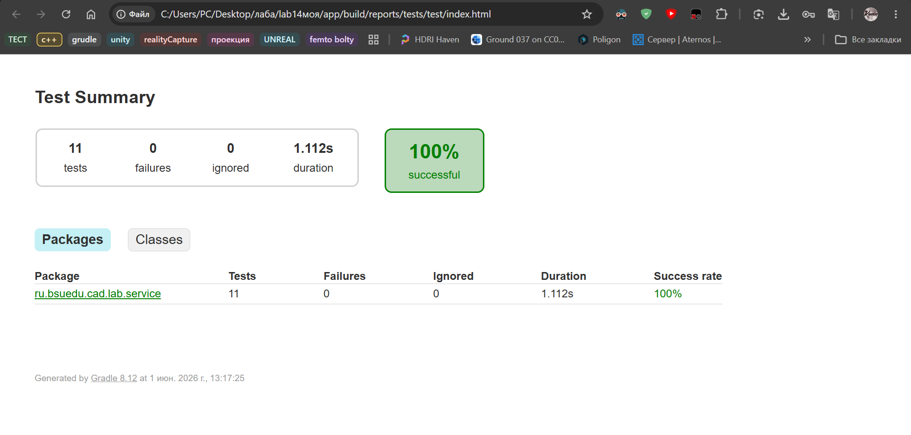
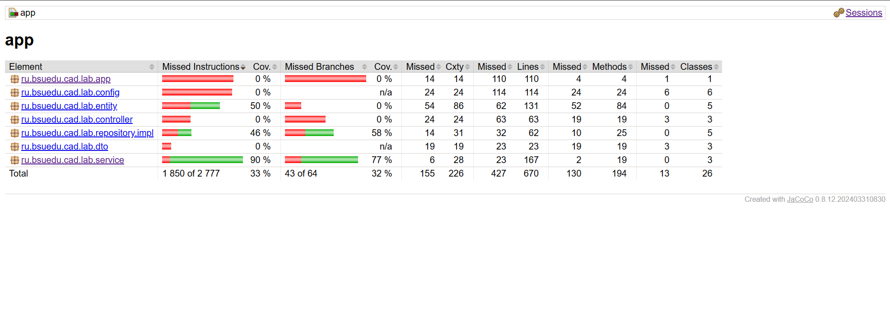

# Отчет по лабораторной работе №8
## Выполнение работы
1. Класс TestAppConfig
```
package ru.bsuedu.cad.lab.config;

import com.zaxxer.hikari.HikariConfig;
import com.zaxxer.hikari.HikariDataSource;
import org.springframework.context.annotation.Bean;
import org.springframework.context.annotation.ComponentScan;
import org.springframework.context.annotation.Configuration;
import org.springframework.data.jpa.repository.config.EnableJpaRepositories;
import org.springframework.orm.jpa.JpaTransactionManager;
import org.springframework.orm.jpa.LocalContainerEntityManagerFactoryBean;
import org.springframework.orm.jpa.vendor.HibernateJpaVendorAdapter;
import org.springframework.transaction.PlatformTransactionManager;
import org.springframework.transaction.annotation.EnableTransactionManagement;

import javax.sql.DataSource;
import java.util.Properties;

@Configuration
@ComponentScan(basePackages = {
    "ru.bsuedu.cad.lab.service",
    "ru.bsuedu.cad.lab.repository"
})
@EnableTransactionManagement
@EnableJpaRepositories(basePackages = "ru.bsuedu.cad.lab.repository")
public class TestAppConfig {

    @Bean
    public DataSource dataSource() {
        HikariConfig config = new HikariConfig();
        config.setJdbcUrl("jdbc:h2:mem:testdb;DB_CLOSE_DELAY=-1;MODE=MySQL");
        config.setUsername("sa");
        config.setPassword("");
        config.setDriverClassName("org.h2.Driver");
        config.setMaximumPoolSize(5);
        return new HikariDataSource(config);
    }

    @Bean
    public LocalContainerEntityManagerFactoryBean entityManagerFactory() {
        LocalContainerEntityManagerFactoryBean em = new LocalContainerEntityManagerFactoryBean();
        em.setDataSource(dataSource());
        em.setPackagesToScan("ru.bsuedu.cad.lab.entity");
        
        HibernateJpaVendorAdapter vendorAdapter = new HibernateJpaVendorAdapter();
        em.setJpaVendorAdapter(vendorAdapter);
        
        Properties properties = new Properties();
        properties.setProperty("hibernate.hbm2ddl.auto", "create-drop");
        properties.setProperty("hibernate.dialect", "org.hibernate.dialect.H2Dialect");
        properties.setProperty("hibernate.show_sql", "false");
        
        em.setJpaProperties(properties);
        return em;
    }

    @Bean
    public PlatformTransactionManager transactionManager() {
        JpaTransactionManager transactionManager = new JpaTransactionManager();
        transactionManager.setEntityManagerFactory(entityManagerFactory().getObject());
        return transactionManager;
    }
}
```

2. Класс OrderServiceIntegrationTest
```
package ru.bsuedu.cad.lab.service;

import org.junit.jupiter.api.BeforeEach;
import org.junit.jupiter.api.Test;
import org.junit.jupiter.api.extension.ExtendWith;
import org.springframework.beans.factory.annotation.Autowired;
import org.springframework.test.context.ContextConfiguration;
import org.springframework.test.context.junit.jupiter.SpringExtension;
import org.springframework.transaction.annotation.Transactional;
import ru.bsuedu.cad.lab.config.TestAppConfig;
import ru.bsuedu.cad.lab.entity.Category;
import ru.bsuedu.cad.lab.entity.Customer;
import ru.bsuedu.cad.lab.entity.Order;
import ru.bsuedu.cad.lab.entity.Product;
import ru.bsuedu.cad.lab.repository.CategoryRepository;
import ru.bsuedu.cad.lab.repository.CustomerRepository;
import ru.bsuedu.cad.lab.repository.ProductRepository;

import java.math.BigDecimal;
import java.util.Arrays;
import java.util.List;

import static org.assertj.core.api.Assertions.*;

@ExtendWith(SpringExtension.class)
@ContextConfiguration(classes = {TestAppConfig.class})
@Transactional
class OrderServiceIntegrationTest {

    @Autowired
    private OrderService orderService;

    @Autowired
    private CustomerRepository customerRepository;

    @Autowired
    private ProductRepository productRepository;

    @Autowired
    private CategoryRepository categoryRepository;

    private Customer testCustomer;
    private Product testProduct1;
    private Product testProduct2;

    @BeforeEach
    void setUp() {
        Category category = new Category("Food", "Animal food");
        category = categoryRepository.save(category);

        testCustomer = new Customer("Ivan Petrov", "ivan@mail.ru", "+79991234567", "Lenina st, 1");
        testCustomer = customerRepository.save(testCustomer);

        testProduct1 = new Product("Dog food", "Premium", category,
                new BigDecimal("1500.00"), 100, null);
        testProduct1 = productRepository.save(testProduct1);

        testProduct2 = new Product("Toy", "Rubber toy", category,
                new BigDecimal("300.00"), 50, null);
        testProduct2 = productRepository.save(testProduct2);
    }

    @Test
    void createOrder_Success() {
        List<OrderService.OrderItemRequest> items = Arrays.asList(
                new OrderService.OrderItemRequest(testProduct1.getId(), 2),
                new OrderService.OrderItemRequest(testProduct2.getId(), 3)
        );

        Order order = orderService.createOrder(testCustomer.getId(), items, testCustomer.getAddress());

        assertThat(order).isNotNull();
        assertThat(order.getId()).isNotNull();
        assertThat(order.getStatus()).isEqualTo("NEW");
        assertThat(order.getOrderDetails()).hasSize(2);
    }

    @Test
    void createOrder_CustomerNotFound() {
        List<OrderService.OrderItemRequest> items = Arrays.asList(
                new OrderService.OrderItemRequest(testProduct1.getId(), 1)
        );

        assertThatThrownBy(() -> orderService.createOrder(9999L, items, "Address"))
                .isInstanceOf(RuntimeException.class);
    }

    @Test
    void createOrder_ProductNotFound() {
        List<OrderService.OrderItemRequest> items = Arrays.asList(
                new OrderService.OrderItemRequest(9999L, 1)
        );

        assertThatThrownBy(() -> orderService.createOrder(testCustomer.getId(), items, "Address"))
                .isInstanceOf(RuntimeException.class);
    }

    @Test
    void createOrder_InsufficientStock() {
        List<OrderService.OrderItemRequest> items = Arrays.asList(
                new OrderService.OrderItemRequest(testProduct1.getId(), 200)
        );

        assertThatThrownBy(() -> orderService.createOrder(testCustomer.getId(), items, "Address"))
                .isInstanceOf(RuntimeException.class);
    }
}
```
3. Класс OrderServiceTest
```
package ru.bsuedu.cad.lab.service;

import org.junit.jupiter.api.BeforeEach;
import org.junit.jupiter.api.Test;
import org.junit.jupiter.api.extension.ExtendWith;
import org.mockito.InjectMocks;
import org.mockito.Mock;
import org.mockito.junit.jupiter.MockitoExtension;
import ru.bsuedu.cad.lab.entity.Customer;
import ru.bsuedu.cad.lab.entity.Order;
import ru.bsuedu.cad.lab.entity.Product;
import ru.bsuedu.cad.lab.repository.*;

import java.math.BigDecimal;
import java.util.Arrays;
import java.util.List;
import java.util.Optional;

import static org.assertj.core.api.Assertions.*;
import static org.mockito.ArgumentMatchers.any;
import static org.mockito.ArgumentMatchers.anyLong;
import static org.mockito.Mockito.*;

@ExtendWith(MockitoExtension.class)
class OrderServiceTest {

    @Mock
    private OrderRepository orderRepository;

    @Mock
    private OrderDetailRepository orderDetailRepository;

    @Mock
    private CustomerRepository customerRepository;

    @Mock
    private ProductRepository productRepository;

    @InjectMocks
    private OrderService orderService;

    private Customer testCustomer;
    private Product testProduct1;
    private Product testProduct2;
    private Order testOrder;

    @BeforeEach
    void setUp() {
        testCustomer = new Customer("Ivan Petrov", "ivan@mail.ru", "+79991234567", "Lenina st, 1");
        testCustomer.setId(1L);

        testProduct1 = new Product();
        testProduct1.setId(1L);
        testProduct1.setName("Dog food");
        testProduct1.setPrice(new BigDecimal("1500.00"));
        testProduct1.setStockQuantity(100);

        testProduct2 = new Product();
        testProduct2.setId(2L);
        testProduct2.setName("Toy");
        testProduct2.setPrice(new BigDecimal("300.00"));
        testProduct2.setStockQuantity(50);

        testOrder = new Order(testCustomer, "Lenina st, 1");
        testOrder.setId(1L);
    }

    @Test
    void createOrder_Success() {
        Long customerId = 1L;
        String shippingAddress = "Lenina st, 1";
        List<OrderService.OrderItemRequest> items = Arrays.asList(
            new OrderService.OrderItemRequest(1L, 2),
            new OrderService.OrderItemRequest(2L, 1)
        );

        when(customerRepository.findById(customerId)).thenReturn(Optional.of(testCustomer));
        when(productRepository.findById(1L)).thenReturn(Optional.of(testProduct1));
        when(productRepository.findById(2L)).thenReturn(Optional.of(testProduct2));
        when(orderRepository.save(any(Order.class))).thenReturn(testOrder);
        when(orderDetailRepository.save(any())).thenReturn(null);

        Order createdOrder = orderService.createOrder(customerId, items, shippingAddress);

        assertThat(createdOrder).isNotNull();
        verify(customerRepository, times(1)).findById(customerId);
        verify(productRepository, times(2)).findById(anyLong());
    }

    @Test
    void createOrder_CustomerNotFound() {
        Long customerId = 999L;
        String shippingAddress = "Lenina st, 1";
        List<OrderService.OrderItemRequest> items = Arrays.asList(
            new OrderService.OrderItemRequest(1L, 2)
        );

        when(customerRepository.findById(customerId)).thenReturn(Optional.empty());

        assertThatThrownBy(() -> orderService.createOrder(customerId, items, shippingAddress))
            .isInstanceOf(RuntimeException.class);

        verify(customerRepository, times(1)).findById(customerId);
        verify(orderRepository, never()).save(any());
    }

    @Test
    void createOrder_ProductNotFound() {
        Long customerId = 1L;
        String shippingAddress = "Lenina st, 1";
        List<OrderService.OrderItemRequest> items = Arrays.asList(
            new OrderService.OrderItemRequest(999L, 2)
        );

        when(customerRepository.findById(customerId)).thenReturn(Optional.of(testCustomer));
        when(productRepository.findById(999L)).thenReturn(Optional.empty());

        assertThatThrownBy(() -> orderService.createOrder(customerId, items, shippingAddress))
            .isInstanceOf(RuntimeException.class);

        verify(customerRepository, times(1)).findById(customerId);
        verify(productRepository, times(1)).findById(999L);
    }

    @Test
    void createOrder_InsufficientStock() {
        Long customerId = 1L;
        String shippingAddress = "Lenina st, 1";
        List<OrderService.OrderItemRequest> items = Arrays.asList(
            new OrderService.OrderItemRequest(1L, 200)
        );

        when(customerRepository.findById(customerId)).thenReturn(Optional.of(testCustomer));
        when(productRepository.findById(1L)).thenReturn(Optional.of(testProduct1));

        assertThatThrownBy(() -> orderService.createOrder(customerId, items, shippingAddress))
            .isInstanceOf(RuntimeException.class);

        verify(customerRepository, times(1)).findById(customerId);
        verify(productRepository, times(1)).findById(1L);
    }

    @Test
    void getAllOrders_Success() {
        List<Order> expectedOrders = Arrays.asList(testOrder);
        when(orderRepository.findAll()).thenReturn(expectedOrders);

        List<Order> actualOrders = orderService.getAllOrders();

        assertThat(actualOrders).hasSize(1);
        verify(orderRepository, times(1)).findAll();
    }

    @Test
    void getOrderById_Success() {
        Long orderId = 1L;
        when(orderRepository.findById(orderId)).thenReturn(Optional.of(testOrder));

        Order foundOrder = orderService.getOrderById(orderId);

        assertThat(foundOrder).isNotNull();
        assertThat(foundOrder.getId()).isEqualTo(orderId);
        verify(orderRepository, times(1)).findById(orderId);
    }

    @Test
    void deleteOrder_Success() {
        Long orderId = 1L;
        when(orderRepository.findById(orderId)).thenReturn(Optional.of(testOrder));
        doNothing().when(orderRepository).delete(any(Order.class));

        orderService.deleteOrder(orderId);

        verify(orderRepository, times(1)).findById(orderId);
        verify(orderRepository, times(1)).delete(testOrder);
    }
}
```

4. Настройка build.gradle.kts (плагин JaCoCo и тестовые зависимости)
```
plugins {
    java
    war
    jacoco
}

dependencies {
    // ... основные зависимости ...

    // TESTING
    testImplementation("org.junit.jupiter:junit-jupiter:5.10.2")
    testImplementation("org.mockito:mockito-core:5.10.0")
    testImplementation("org.mockito:mockito-junit-jupiter:5.10.0")
    testImplementation("org.assertj:assertj-core:3.25.3")
    testImplementation("org.springframework:spring-test:6.1.3")
}

tasks.test {
    useJUnitPlatform()
    finalizedBy(tasks.jacocoTestReport)
}

tasks.jacocoTestReport {
    dependsOn(tasks.test)
    reports {
        xml.required.set(false)
        csv.required.set(false)
        html.required.set(true)
        html.outputLocation.set(layout.buildDirectory.dir("reports/jacoco"))
    }
}

tasks.jacocoTestCoverageVerification {
    violationRules {
        rule {
            limit {
                minimum = "0.60".toBigDecimal()
            }
        }
    }
}
```

## Используемые библиотеки

- **JUnit 5 (Jupiter)** — каркас тестирования: аннотации `@Test`, `@BeforeEach`, запуск тестов.
- **Mockito** — создание mock-объектов (заглушек) для зависимостей в unit-тестах: `@Mock`, `@InjectMocks`, `when(...).thenReturn(...)`, `verify(...)`.
- **AssertJ** — «текучие» проверки: `assertThat(...)`, `assertThatThrownBy(...)`.
- **Spring Test** (`SpringExtension`) — поднимает контекст Spring для внедрения реальных бинов в интеграционных тестах.
- **H2 Database** — база данных в оперативной памяти, используется в интеграционных тестах вместо настоящей БД.
- **JaCoCo** — измеряет покрытие кода тестами (code coverage) и строит HTML-отчёт.

**Unit-тесты** (`OrderServiceTest`) проверяют сервис `OrderService` в изоляции: репозитории заменяются mock-объектами Mockito, БД не используется. Проверены удачное создание заказа и неудачные случаи (покупатель не найден, товар не найден, недостаточно товара), а также чтение и удаление.

**Интеграционные тесты** (`OrderServiceIntegrationTest`) проверяют совместную работу сервиса со слоем репозиториев и реальной БД H2. Класс помечен `@Transactional` — каждый тест выполняется в транзакции, которая откатывается, поэтому тесты независимы. Проверены удачное (заказ реально сохраняется в БД) и неудачное взаимодействие слоёв.

Запуск тестирования и формирование отчётов:
```
gradle test jacocoTestReport
```

Отчёты:
- результаты тестов — `app/build/reports/tests/test/index.html`;
- покрытие JaCoCo — `app/build/reports/jacoco/index.html`.

Результат: все **11 тестов** (7 unit + 4 интеграционных) проходят успешно, покрытие класса `OrderService` — **90%** инструкций.

## Диаграмма классов

```mermaid
classDiagram
class AppConfig {
-Environment env
+dataSource() DataSource
+entityManagerFactory() LocalContainerEntityManagerFactoryBean
+transactionManager() PlatformTransactionManager
}

    class TestAppConfig {
        +dataSource() DataSource
        +entityManagerFactory() LocalContainerEntityManagerFactoryBean
        +transactionManager() PlatformTransactionManager
    }
    
    class SecurityConfig {
        +passwordEncoder() PasswordEncoder
        +userDetailsService() UserDetailsService
        +apiSecurityFilterChain(HttpSecurity) SecurityFilterChain
        +formLoginSecurityFilterChain(HttpSecurity) SecurityFilterChain
    }
    
    class WebConfig {
        -ApplicationContext applicationContext
        +templateResolver() SpringResourceTemplateResolver
        +templateEngine() SpringTemplateEngine
        +configureViewResolvers(ViewResolverRegistry) void
    }

    class AuthController {
        +loginPage(error, logout, model) String
    }
    
    class OrderController {
        -OrderService orderService
        -CustomerRepository customerRepository
        -ProductRepository productRepository
        +listOrders(Model) String
        +showCreateForm(Model, error) String
        +createOrder(CreateOrderRequest) String
        +viewOrder(id, Model) String
        +deleteOrder(id) String
        +updateOrderStatus(id, status) String
    }
    
    class OrderRestController {
        -OrderService orderService
        +getAllOrders() List~Order~
        +getOrderById(id) Order
        +createOrder(CreateOrderRequest) Order
        +deleteOrder(id) String
        +updateOrder(id, status) Order
    }
    
    class ProductRestController {
        -ProductRepository productRepository
        +getAllProducts() List~ProductInfoDTO~
    }

    class OrderService {
        -OrderRepository orderRepository
        -OrderDetailRepository orderDetailRepository
        -CustomerRepository customerRepository
        -ProductRepository productRepository
        +createOrder(customerId, items, address) Order
        +getAllOrders() List~Order~
        +getOrderById(id) Order
        +deleteOrder(id) void
        +updateOrderStatus(id, status) Order
    }
    
    class DataLoaderService {
        -CategoryRepository categoryRepository
        -CustomerRepository customerRepository
        -ProductRepository productRepository
        +loadAllData() void
        +loadCategories() void
        +loadCustomers() void
        +loadProducts() void
    }

    class CategoryRepository {
        <<interface>>
        +save(Category) Category
        +findById(id) Optional~Category~
        +findAll() List~Category~
    }
    
    class CustomerRepository {
        <<interface>>
        +save(Customer) Customer
        +findById(id) Optional~Customer~
        +findByEmail(email) Optional~Customer~
        +findAll() List~Customer~
    }
    
    class OrderRepository {
        <<interface>>
        +save(Order) Order
        +findById(id) Optional~Order~
        +findAll() List~Order~
        +findByCustomerId(customerId) List~Order~
        +delete(Order) void
    }
    
    class OrderDetailRepository {
        <<interface>>
        +save(OrderDetail) OrderDetail
        +findById(id) Optional~OrderDetail~
        +findAll() List~OrderDetail~
        +findByOrderId(orderId) List~OrderDetail~
    }
    
    class ProductRepository {
        <<interface>>
        +save(Product) Product
        +findById(id) Optional~Product~
        +findAll() List~Product~
        +findByCategoryId(categoryId) List~Product~
    }

    class Category {
        -Long id
        -String name
        -String description
        -List~Product~ products
    }
    
    class Customer {
        -Long id
        -String name
        -String email
        -String phone
        -String address
        -List~Order~ orders
    }
    
    class Order {
        -Long id
        -Customer customer
        -LocalDateTime orderDate
        -BigDecimal totalPrice
        -String status
        -String shippingAddress
        -List~OrderDetail~ orderDetails
    }
    
    class OrderDetail {
        -Long id
        -Order order
        -Product product
        -Integer quantity
        -BigDecimal price
        +getSubtotal() BigDecimal
    }
    
    class Product {
        -Long id
        -String name
        -String description
        -Category category
        -BigDecimal price
        -Integer stockQuantity
    }

    class OrderServiceTest {
        -OrderRepository orderRepository
        -OrderDetailRepository orderDetailRepository
        -CustomerRepository customerRepository
        -ProductRepository productRepository
        -OrderService orderService
        +setUp() void
        +createOrder_Success() void
        +createOrder_CustomerNotFound() void
        +createOrder_ProductNotFound() void
        +createOrder_InsufficientStock() void
        +getAllOrders_Success() void
        +getOrderById_Success() void
        +deleteOrder_Success() void
    }
    
    class OrderServiceIntegrationTest {
        -OrderService orderService
        -CustomerRepository customerRepository
        -ProductRepository productRepository
        -CategoryRepository categoryRepository
        +setUp() void
        +createOrder_Success() void
        +createOrder_CustomerNotFound() void
        +createOrder_ProductNotFound() void
        +createOrder_InsufficientStock() void
    }

    class CreateOrderRequest {
        -Long customerId
        -String shippingAddress
        -List~OrderItemRequest~ items
    }
    
    class ProductInfoDTO {
        -String productName
        -String categoryName
        -Integer stockQuantity
    }

    AppConfig <|-- TestAppConfig : extends
    
    OrderController --> OrderService
    OrderController --> CustomerRepository
    OrderController --> ProductRepository
    
    OrderRestController --> OrderService
    ProductRestController --> ProductRepository
    
    OrderService --> OrderRepository
    OrderService --> OrderDetailRepository
    OrderService --> CustomerRepository
    OrderService --> ProductRepository
    
    DataLoaderService --> CategoryRepository
    DataLoaderService --> CustomerRepository
    DataLoaderService --> ProductRepository
    
    OrderServiceTest ..> OrderService : tests
    OrderServiceTest ..> OrderRepository : mocks
    OrderServiceTest ..> CustomerRepository : mocks
    OrderServiceTest ..> ProductRepository : mocks
    
    OrderServiceIntegrationTest ..> OrderService : tests
    OrderServiceIntegrationTest --> TestAppConfig : uses
    
    Order "1" --> "*" OrderDetail : contains
    Order "*" --> "1" Customer : belongs to
    OrderDetail "*" --> "1" Product : references
    Product "*" --> "1" Category : belongs to
    Customer "1" --> "*" Order : has
    
    OrderController ..> CreateOrderRequest : uses
    OrderRestController ..> CreateOrderRequest : uses
    ProductRestController ..> ProductInfoDTO : returns
```


## Отчет о тестах


